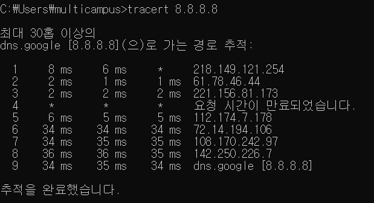
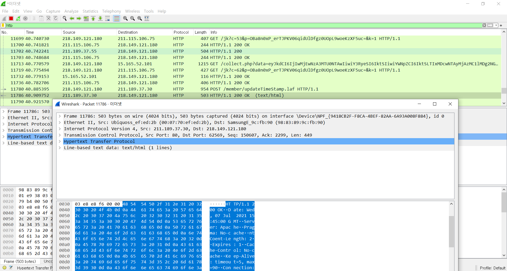
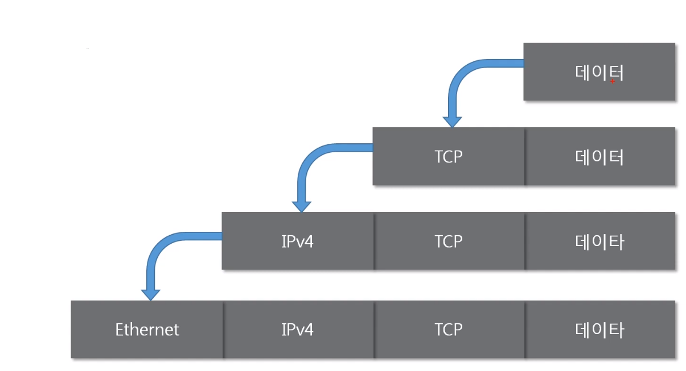
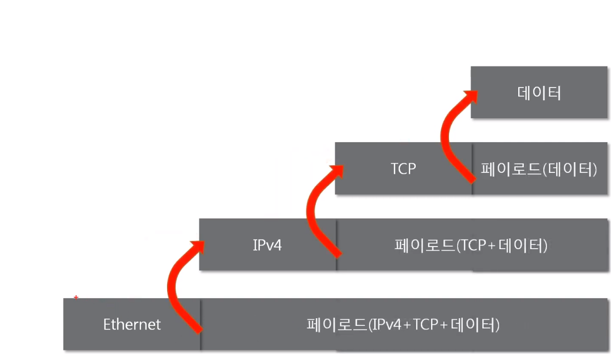

# 네트워크란 무엇인가?

- **네트워크** : 분산되어있는 컴퓨터를 통신망으로 연결한 것
- **인터넷** : 문서, 그림 영상과 같은 여러가지 데이터를 `공유`하도록 구성된 세상에서 가장 큰 전세계를 연결하는 `네트워크`

  - `www`를 인터넷으로 착각하는 경우가 많은데 www는 인터넷을 통해 웹과 관련된 데이터를 공유하는 것이다.

## 네트워크 분류

- 크기에 따른 분류
  - LAN(Local Area Network)
  - WAN(Wide Area Network) : 여러개의 LAN을 연결
- 연결 형태에 따른 분류
  - Star형 : 중앙 장비에 모든 노드가 연결
  - Mesh형 : 여러 노드들이 서로 그물처럼 연결
  - 실제로는 혼합형으로 연결되어 있음.

## 네트워크 통신방식

- 유니캐스트 : 특정한 대상이랑 1:1 통신
- 멀티캐스트 : 특정 다수와 1:N 통신
- 브로드캐스트 : 네트워크에 있는 모든 대상과 통신

## 네트워크 프로토콜

- 네트워크 프로토콜 : 네트워크에서 노드와 노드가 통신할 때 어떤 노드가 어느 노드에게 어떤 데이터를 어떻게 보내는지 작성하기 위한 양식
- 패킷 : 여러 프로토콜들로 캡슐화 된 것.

### [실습1 (tracert)](https://youtu.be/paJf7JbBWqY?list=PL0d8NnikouEWcF1jJueLdjRIC4HsUlULi)

- google과 연결된 경로 추적

### [실습2 (Wireshark)](https://youtu.be/vBrQ3yzerMg?list=PL0d8NnikouEWcF1jJueLdjRIC4HsUlULi)

- 프로토콜 살펴보기

## [네트워크 모델](https://youtu.be/y9nlT52SAcg?list=PL0d8NnikouEWcF1jJueLdjRIC4HsUlULi)

- **TCP/IP**
- **OSI 7계층**

### 계층별 주요 프로토콜

- 7계층 : HTTP
- 4계층 : TCP,UDP
- 3계층 : IP, ICMP, ARP
- 2계층 : 이더넷

### TCP/IP와 OSI 7계층 모델 비교

- 공통점
  - 계층적 네트워크 모델
  - 계층 간 역할 정의
- 차이점
  - 계층 수
  - OSI는 역할 기반, TCP/IP는 프로토콜 기반
  - OSI는 통신 전반에 대한 표준, 논리적으로 상세 분류할 때 적합
  - TCP/IP는 데이터 전송기술 특화, 실무적으로 적합

### 패킷

- 네트워크 상에서 전달되는 데이터를 통칭하는 말
- 네트워크에서 전달하는 데이터의 형식화된 블록
- 제어 정보와 사용자 데이터로 이루어지며, 사용자 데이터는 `페이로드`라고도 한다.
- (헤더) + 페이로드 + (푸터)
  - **패킷을 이용한 통신 과정 - 캡슐화**
    - 상위계층부터 캡슐화
      
  - **패킷을 이용한 통신 과정 - 디캡슐화**
    - 패킷을 `받았을 때` 프로토콜을 하나씩 확인하면서 데이터를 확인하는 과정
    - 하위계층부터 디캡슐화
      

### PDU(Protocal Data Unit) :계층별 패킷의 이름

- 4계층의 PDU : 세그먼트
- 3계층의 PDU : 패킷
- 2계층의 PDU : 프레임
