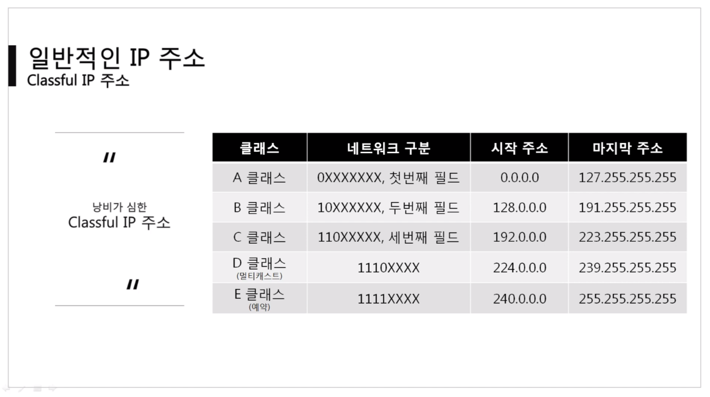

# 3계층 - 실제로 컴퓨터끼리는 IP주소를 사용해 데이터를 주고받는다

## 3계층에서 하는 일

- 3계층은 `다른 네트워크 대역` 즉, 멀리 떨어진 곳에 존재하는 `네트워크`까지 어떻게 데이터를 전달하지 제어하는 일을 담당한다.
- 발신에서 착신까지 패킷의 경로를 제어
- 서로 다른 LAN을 연결시켜주는 역할

### 3계층에서 쓰는 주소

- WAN에서 통신할 때 사용하는 `IP 주소`
  - IPv4 주소 : 현재 PC에 할당된 주소
  - 서브넷 마스크 : IP주소에 대한 네트워크의 대역을 규정하는 것
  - 게이트웨이 주소 : 외부와 통신할 때 사용하는 네트워크의 출입구

### 3계층 프로토콜

- ARP 프로토콜 : IP주소를 이용해 MAC 주소를 알아온다.
- IPv4 프로토콜 : WAN에서 통신할 때 사용한다.
- ICMP 프로토콜 : 서로가 통신되는지 확인할 때 사용한다.

## 일반적인 IP 주소

- 4바이트 10진수로 사용한다.
- 1바이트는 8비트, 2진수 8개 => 0~255를 표현할 수 있다.
- `.`으로 구분한다.

### Classful IP 주소

- A 클래스
  - 0 0000000.00000000.00000000.00000000 ~ 0 1111111.11111111.11111111.11111111
- B 클래스
  - 10 000000.00000000.00000000.00000000 ~ 10 111111.11111111.11111111.11111111
- C 클래스
  - 110 00000.00000000.00000000.00000000 ~ 110 11111.11111111.11111111.11111111
- D 클래스
  - 1110 0000.00000000.00000000.00000000 ~ 1110 1111.11111111.11111111.11111111
- E 클래스

  - 1111 0000.00000000.00000000.00000000 ~ 1111 1111.11111111.11111111.11111111

- **이렇게 나눴던 이유**
  - `A클래스 네트워크 대역`은 앞 1바이트 부분만 가지고 대역을 구분했다.
    - 하나의 네트워크 대역에 속해있는 PC의 갯수는 2\*\*24대 이다.
    - 큰 기관에서나 쓴다.
  - `B클래스 네트워크 대역`은 앞 2바이트 부분만 가지고 대역을 구분했다.
    - A클래스보다 한 대역에 있는 PC가 적다.
    - 그래도 많다.
  - `C클래스 네트워크 대`역은 앞 3바이트 부분만 가지고 대역을 구분했다.
    - 한 네트워크 대역에 256대 정도
  - `D클래스`는 멀티캐스트용으로 남겨둿다.
  - `E클래스`는 실험용으로 남겨둔 IP주소
- 문제점
  - IP주소가 낭비가 된다.
    - A클래스의 한 대역을 차지하는 PC갯수가 너무 많듯이.
    - IP주소가 부족해졌다.
- **해결**
  - 이제부터는 낭비가 많이 되니 `.`으로 대역을 구분하지 말자. => `classfulless`
  - 그래서 `서브넷 마스크`가 등장, 어디서 대역을 구분할 것인가.

### Classfulless IP 주소

- Classless IP주소 : 낭비되지 않도록 아껴쓰는 주소
- 서브넷 마스크
  - 클래스풀한 네트워크 대역을 나눠주는데 사용하는 값
  - 2진수로 표기햇을 때 1로 시작, 1과 1사이에는 0이 올 수 없다는 규칙을 가지고 있다.
  - 1 이후로 남은 비트로 표현할 수 있는 갯수 만큼 PC 할당
  - `255.255.255.192` => 11111111.11111111.11111111.11000000 => 000000 => 64대
- 서브네팅
  - 서브넷 마스크로 대역을 나누는 것

### 사설 IP와 공인 IP

- Classless IP주소로 구분해도 낭비되는 대역이 존재한다.
- 그래서 사설 IP와 공인 IP대역을 나눴다.
- 사설 IP 대역의 장비들은 네트워크 통신을 할때 무조건 공인 IP로 바꿔서 통신을 한다.
- 외부에서 볼 때는 사설 IP 대역의 컴퓨터들이 구분되지 않는다.
- 외부로 요청을 보내면 공인 IP가 다시 외부로 요청한다.(NAT 테이블에 기록)
- 외부에서 통신으로 받은 데이터는 공인 IP가 구분해서 뿌려준다.(NAT테이블 기록을 보고)
  - 나간 기록이 없는 곳으로 데이터가 들어온다면? 공유기가 받고 그냥 끝낸다. 아니면, 공유기에 따로 설정을 해둔다.(4계층의 포트포워딩)
- 네트워크 주소를 사설 IP에서 공유 IP로 바꿔주는 것을 `NAT`라고 한다. (NAT는 사실 특정 IP를 다른 특정 IP로 바꾸는 기술이다, 이 기술을 이용해서 네트워크 부족현상을 해결한다.)
- 다시, 실제 인터넷 세상에서는 공인IP로만 통신 외부 네트워크 대역에서는 사설 IP 대역이 보이지 않는다.

## 특수한 IP 주소

- `0.0.0.0` : Wildcard, **나머지 모든IP**
- `127.0.0.1` : 나 자신을 나타내는 주소
- `게이트웨이 주소`
  - 일반적으로 공유기의 IP
  - 어딘가로 가려면 일단 여기를 거친다.
  - 따로 설정을 안하면 나가는 곳이 어딘지 모르니 인터넷이 안된다.
