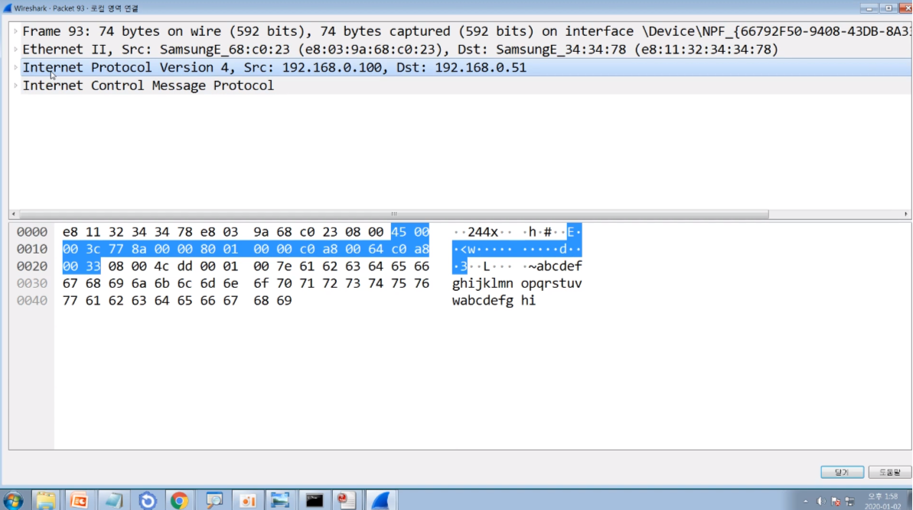
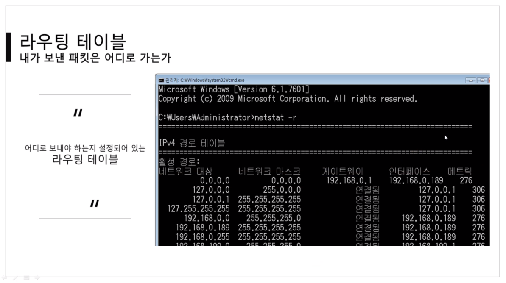
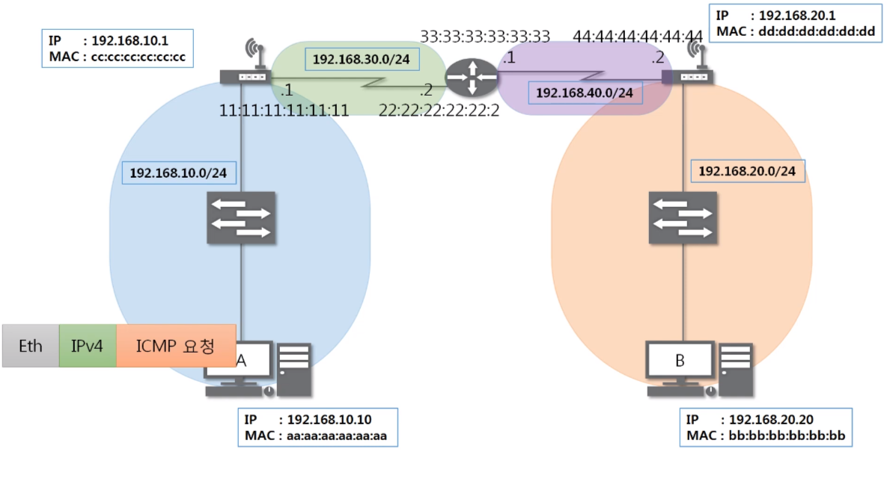
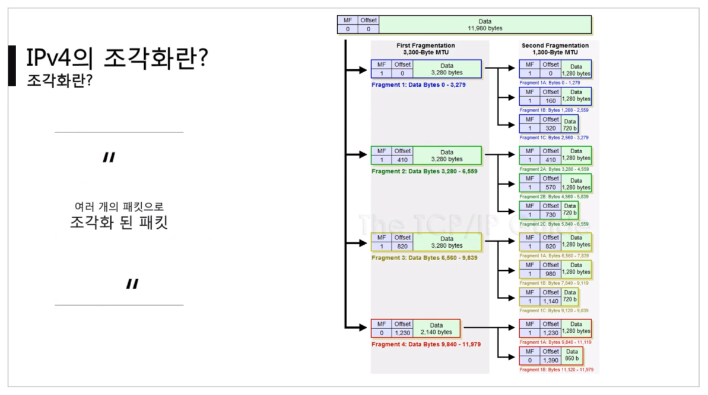
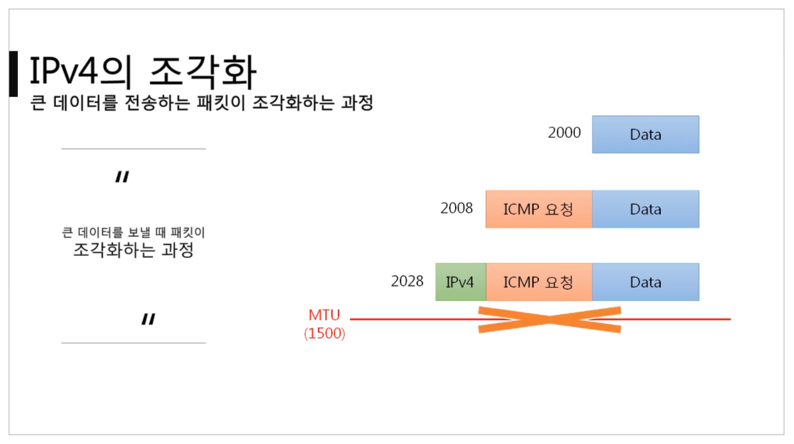
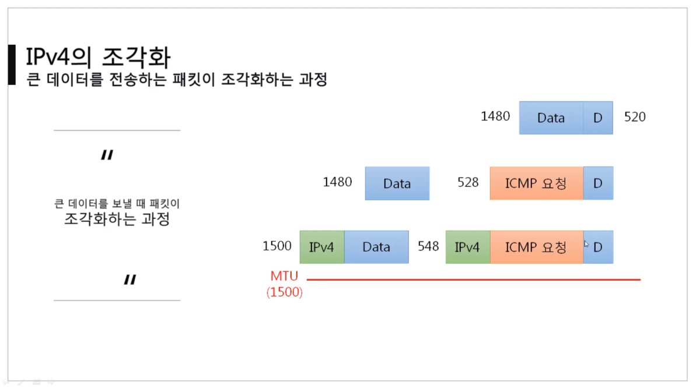
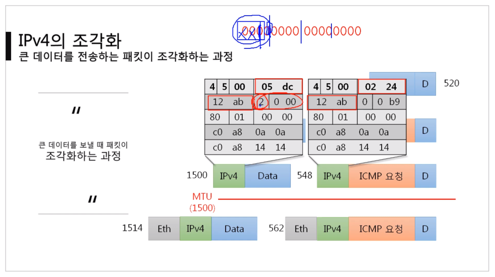

# 멀리 있는 컴퓨터끼리는 이렇게 데이터를 주고받는다(3계층)

## [IPv4 프로토콜](https://youtu.be/_i8O_o2ozlE?list=PL0d8NnikouEWcF1jJueLdjRIC4HsUlULi)

### IPv4가 하는일

- 네트워크 상에서 데이터를 교환하기 위한 프로토콜
- 데이터가 `정확하게 전달될 것을 보장하지 않는다.`
- 중복된 패킷을 전달하거나 패킷의 순서를 잘못 전달할 가능성성도 있다.
  - 악의적으로 이용되면 DoS 공격이 된다.
- 데이터의 정확하고 순차적인 전달은 그보다 상위 프로토콜인 TCP에서 보장한다.

### IPv4 프로토콜의 구조

- 옵션을 제외하고, 20바이트(옵션이 붙을 때마다 증가해서 최대 60바이트 까지)
- Version : 16진수 하나, (4)가 온다. IPv6는 모양 자체가 달라서, IPv4만 고려한다.
- IHL(Header Length) : 길이는 20바이트, (길이/4) 값을 쓴다. (20/4) = (5)가 온다. 최대 60바이트니, (15)까지 올 수 있다.
- TOS(Type of Service) : 서비스의 형식, 예전에 쓰였는데 지금은 안쓰인다. (0)이 온다.
- Total Length : 뒤에 PayLoad까지 합친 길이. 상위 레이어부터 인캡슐레이션 되어서 내려온 전체 길이.
- 데이터가 클 때, 최대 전송단위가 정해져있으니 잘라서 보낸다. 이것을 알아볼 수 있게 해주는 세트들
  - Identification : 원래 하나의 데이터가 잘게 쪼개졌다고 했을 때, 다시 합쳐야 하니 ID를 똑같이 준다.
  - IP Flags : 3bit로 이루어져있다.
    - 첫 번째(x) : 안쓰인다.
    - 두 번째(D) : 데이터를 안쪼개서 보내겠다고 명시(1), 안쪼갰는데 최대 전송단위를 넘긴다면 안보내진다, 거의 안쓴다.
    - 세 번째(M) : 조각화가 되어있다고 명시(1). 나 말고 더 있다.
  - Fragment Offset : 13bit, 원래대로 복구할 때, 순서를 명시한다. 보낼 때는 순서대로 보내지만, 받는 쪽에서는 순서대로 받지 않을 수 있다.
    - Offset : 어느 기준(시작점)으로부터 얼마만큼 떨어져있다.
      - 첫 번째 패킷은 0, 두 번째는 첫번째 패킷의 길이만큼, 세 번째는 첫+두 번째 패킷 길이
- TTL(Time to Live) : 패킷이 살아있을 수 있는 시간, 경로가 꼬여서 계속 네트워크 상에 남아있는 것을 방지.
  - 10이라고 설정하면, 3계층 장비(라우터 등)를 하나씩 넘어갈 때 마다 1씩 줄어든다.
  - 운영체제마다 설정하는 값이 다르다.(상대방의 운영체제를 알아낼 수 있다.)
    - Window : (128)
    - Linux : (64)
- Protocol : 상위 프로토콜이 뭔지 알려준다.
  - ICMP : 1
  - TCP : 06
  - UDP : 17
- Header Checksum : 헤더가 오류가 있는지 없는지 확인한다. 여러 필드들을 계산해서 넣어 보낸다. 받는 쪽에서는 세팅된 값들을 계산해서 `Header Checksum`이랑 비교한다. 같으면 제대로 전달 받은 것이다.
- Source Address : 출발지 IP 4바이트
- Destination Address : 목적지 IP 4바이트

## [ICMP 프로토콜](https://youtu.be/JaBCIUsFE74?list=PL0d8NnikouEWcF1jJueLdjRIC4HsUlULi)

### ICMP가 하는 일

- ICMP(Internet Control Message Protocol, 인터넷 제어 메시지 프로토콜)
- 네트워크 위에서 돌아가는 운영체제에서 `오류 메시지`를 전송 받는 데 주로 쓰인다.
- 프로토콜 구조의 Type과 Code를 통해 오류 메시지를 전송 받는다.
- 특정 대상과 내가 통신이 되나 안되나 확인하기 위한 프로토콜

### ICMP 프로토콜의 구조

- 8바이트
- Checksum : 헤더에 오류가 있는지 검사하기 위한 값
- Type : 대분류
  - 0 : 응답(상대방이 나에게)
  - 8 : 요청(내가 상대방에게, 통신 좀 할게)
  - 3 : Destination Unreachable, 목적지에 도달할 수 없다.
    - 목적지까지 가지를 못한 것.
  - 11 : Time Exceded, 요청 시간이 만료되었다.
    - 목적지까지 갔는데 응답을 못받은 것.
    - 상대방 문제(주로 상대방 방화벽 켜져있을 때)
  - 5 : ICMP Redirect, 예전에 쓰던 것.
    - 원격지에 있는 상대방의 라우팅 테이블을 ICMP 가지고 수정할 때 사용.
- Code : 소분류(이것까지는.. 몰라도..!)

## [IPv4, ICMP프로토콜 실습](https://youtu.be/8ZwTvTuZlVw?list=PL0d8NnikouEWcF1jJueLdjRIC4HsUlULi)

## [라우팅 테이블](https://youtu.be/CjnKNIyREHA?list=PL0d8NnikouEWcF1jJueLdjRIC4HsUlULi)

### 내가 보낸 패킷은 어디로 가는가

- 어디로 보내야 하는지 설정되어 있는 `라우팅 테이블`
- `라우팅 테이블`에 설정되어 있어야만 보낼 수 있다.
- 명령어 `netstat -r`
- 지도에 없으면 못보내니까 기본 값을 하나 넣어준다.(게이트웨이)
  

### 다른 네트워크까지 내 패킷의 이동 과정

- A와 B가 통신하려고 한다.
  1. A의 라우팅 테이블에 B의 네트워크 대역이 있어야한다.
  2. ICMP 요청 프로토콜을 만든다.(요청은 8)
  3. IPv4 프로토콜을 작성한다.
  4. Ethernet 프로토콜을 작성한다.(목적지의 MAC 주소는 지금 모르니, 가까운 곳에서 갈 수있는 곳까지 써놓는다, 게이트 웨이의 MAC주소)
  5. 스위치가 2계층을 확인하고 게이트웨이로 보낸다.
  6. 게이트웨이가 자기의 라우팅 테이블을 확인하고, 이더넷 프로토콜을 다시 만든다.(가까운 곳, 3계층 장비 까지)
  7. 3계층 장비는 다시 까서 이더넷 프로토콜을 다시 만들어 상대방의 게이트웨이로 보낸다.
  8. 상대방의 게이트웨이도 이더넷을 다시 만들어 가까운 곳으로 보낸다.
  - 즉, 네트워크 대역이 바뀔 때마다, 이더넷 프로토콜을 다시 쓴다.

## [라우팅 테이블 확인 실습](https://youtu.be/tVntagSJctc?list=PL0d8NnikouEWcF1jJueLdjRIC4HsUlULi)

- cmd/ `netstat -r`

## [IPv4 조각화 이론](https://youtu.be/_AONcID7Sc8?list=PL0d8NnikouEWcF1jJueLdjRIC4HsUlULi)

### 조각화란?

- 큰 IP 패킷들이 적은 `MTU`(Maximum Transmission Unit, 최대 전송 단위, 일반적으로 대부분 1500바이트로 설정되어 있다.)를 갖는 링크를 통하여 전송되려면 `여러 개의 작은 패킷으로 쪼개어/조각화 되어 전송`돼야 한다.
- 즉, 목적지까지 패킷을 전달하는 과정에 통과하는 각 라우터마다 전송에 적합한 프레임으로 변환이 필요하다.
- 일단 조각화되면, 최종 목적지에 도달할 때까지 재조립되지 않는 것이 일반적이다.
- IPv4에서는 발신지 뿐만 아니라 중간 라우터에서도 IP조각화가 가능하다.
- IPv6에서는 IP 단편화가 발신지에서만 가능하고, 재조립은 항상 최종 수신지에서만 가능하다.

### 조각화 살펴보기

1. 데이터는 11980바이트
2. MTU가 3300
3. IPv4가 20바이트니 3280씩 쪼갠다.
4. 두 번째 쪼개진 패킷 Offset이 410인 것은 8로 나눈 값이다.(3280/8 = 410)
5. 네 번째 쪼개진 패킷 MF은 0, 내 뒤에 더 없다.

### 큰 데이터를 전송하는 패킷이 조각화하는 과정

 0. MTU는 1500바이트

1. Data 2000을 보낼 때,
2. ICMP가 붙어 2008 바이트가 된다.
3. IPv4가 붙어 2028 바이트가 된다.
4. 전송되지 못한다.

1. Data를 1(1480)과 2(520)으로 쪼갠다.
2. 1에 IPv4가 붙어 (1500)이 된다.
3. 2에 IPv4와 ICMP가 붙어 (548)이 된다.
4. 전송된다.
5. 1에 Ethernet이 붙어 (1514)가 된다.
6. 2에 Ethernet이 붙어 (562)가 된다.

- 실제로 전송되는 frame 2계층의 PDU 단위는 주로 1514가 된다.
- 패킷 캡쳐 해보면 1514가 많이 보일 것이다.
- IPv4가 붙고! Ethernet이 붙는다.

### [IPv4 조각화 실습](https://youtu.be/QKEL9aBgHtg?list=PL0d8NnikouEWcF1jJueLdjRIC4HsUlULi)

#### 실습 1

- 보내려는 데이터 크기 : 2379
- MTU : 980
- 몇 개의 패킷으로 쪼개지는가? 3
- 첫 번째 패킷의 데이터의 크기는 몇인가? 960
- 마지막 패킷의 데이터의 크기는 몇인가? 459

패킷 1 : 20+960 (mf(more fragment):1 / offset 0)
패킷 2 : 20+960 (mf:1 / offset 120(960/8))
패킷 3 : 20+8+469 (mf:0 / offset 240)

- 이더넷이 붙으면 +14

---

#### 실습2

- 보내려는 데이터 크기 : 4800
- MTU : 1500
- 몇 개의 패킷으로 쪼개지는가? 4
- 첫 번째 패킷의 데이터의 크기는 몇인가? 1480
- 마지막 패킷의 데이터의 크기는 몇인가? 360

패킷 1 : 20+1480 (mf:1 / offset 0)
패킷 2 : 20+1480 (mf:1 / offset 185(1480/8))
패킷 3 : 20+1480 (mf:1 / offset 370)
패킷 4 : 20+8+360 (mf:0 / offset 555)

- 이더넷이 붙으면 +14
